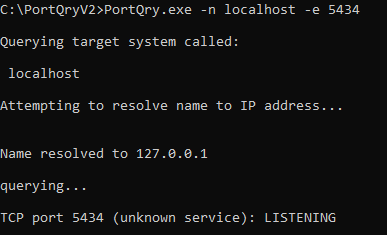
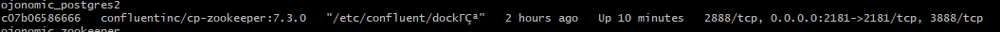
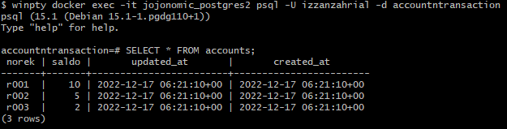

# Jojonomic Interview

This is my assignment for a jojonomic interview

## Prerequisites

1. golang
2. docker
3. docker-compose

## Step by step

### Install and run all the depedencies

This mean you need to start up your docker. Then run docker-compose

```
docker-compose up
```

Since the main file is in cmd you need to cd to the each main file. Run the application from the service first then the storage

#### Run input harga service and storage
```
cd cmd/input-harga-service
go run main.go

cd cmd/input-harga-storage
go run main.go
```

#### Run check harga service
```
cd cmd/check-harga-service
go run main.go
```

#### Run topup service and storage
```
cd cmd/topup-service
go run main.go

cd cmd/topup-storage
go run main.go
```

#### Run check saldo service
```
cd cmd/check-saldo-service
go run main.go
```

#### Run check mutasi service
```
cd cmd/check-mutasi-service
go run main.go
```

### Run buyback service and storage
```
cd cmd/buyback-service
go run main.go

cd cmd/buyback-storage
go run main.go
```

### Dummy data

Since there are no data in accounts table to get the value, i add some data to make sure we can call the accounts table.

No. | norek | saldo |
--- | --- | --- | 
1 | r001 | 10 |
2 | r002 | 5 |
3 | r003 | 2 |

### Problem

Currently there is a problem to connect to the account and transaction database inside jojonomic_postgres2 container, even though the container and database is running and i can connect to it via CLI, my application cannot connect to it because of EOF. My current goal is to tackle this problem.







### Summary

This application can improve even further if we implement index and memory storage, but overall this application should do it's job.
